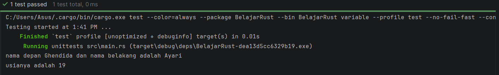
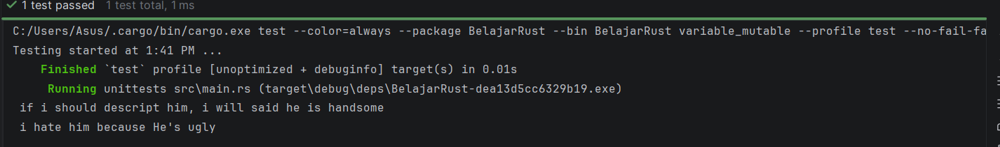
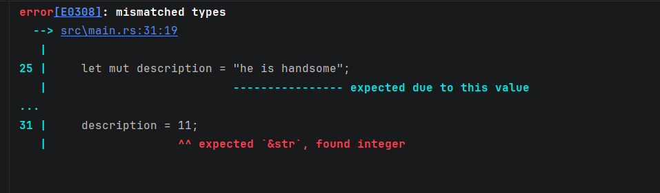
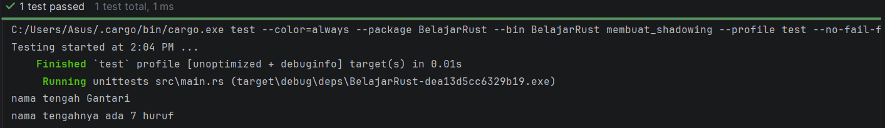

## Ini adalah repository untuk belajar Rust dan dokumentasinya

---

### Hello World
```
fn main() {
println!("Hello, world!");
}

```
ini adalah cara melakukan hello world di bahasa pemrograman rust.

---
### Cargo (cara melakukan run di rust dengan terminal)

di rust ada beberapa cara untuk melakukan run yaitu:
1. cargo run, ini akan merun fn main yang utama
2. cargo test "nama unit test" --exact --nocapture, ini akan merun unit test selain fungsi utama.
3. cargo test "nama unit test" --exact, sama dengan sebelumnya bedanya ini hanya melakukan run tanpa mencetak hasilnya

--- 

### Variable

#### Immutable variable
```
#[test]
fn variable(){
    let first_name = "Ghendida";
    let last_name = "Ayari";
    let age = 19;
    println!( "nama depan {} dan nama belakang adalah {} ", first_name, last_name);
    println!( "usianya adalah {} ", age);
}
```
Di rust variable memggunakan kata kunci let. let ini adalah kata kunci untuk variable yang tidak bisa diubah
jadi isi dari variable tetap tidak bisa diubah lagi setelahnya
<br>

<br>
#### Mutable variable

```
#[test]
fn variable_mutable(){
    let mut description = "he is handsome";
    println!( " if i should descript him, i will said {} ", description );

    description = "He's ugly ";
    println!( " i hate him because {} ", description );
}
```
Jika tetap ingin mengubah isi dari variable maka bisa menggunakan kata kunci let mut seperti contoh di atas
<br>

<br>
#### Static typing

```
#[test]
fn variable_mutable(){
let mut description = "he is handsome";
println!( " if i should descript him, i will said {} ", description );

    description = "He's ugly ";
    println!( " i hate him because {} ", description );

    description = 11;
    println!("kayaknya aku pilih angka {}" , description);
}
```
Di rust kita tidak bisa mengubah tipe data dari string ke integer misalnya seperti di bahasa lain contohnya php, javascript walaupun kita menggunakan let mut. Jika dipaksa maka hasilnya akan error
karena rust adalah bahasa yang bersifat static sama seperti java dan golang.
<br>

<br>
#### Shadowing
Di rust kita bisa membuat nama variable yang sama, tapi saat kita membuat variable yang sama, variable sebelumnya akan tertutup atau biasanya disebut 
shadowing. Praktek ini tidak baik jika dilakukan terlalu sering karena bisa membingungkan orang yang membaca kode kita. <br>
```
#[test]
fn membuat_shadowing(){
    let nama_tengah = "Gantari";
    
    let nama_tengah = 7;
    println!("nama tengahnya ada {} huruf", nama_tengah);
}
```
<br> output:

